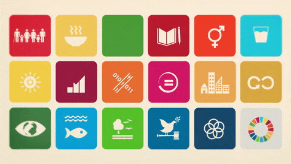

### Modalidades da Jornada da Extensão da Cruzeiro do Sul Virtual

Você deverá realizar as atividades extensionistas de forma presencial junto à comunidade local. Trata-se de componentes previstos em sua matriz curricular, que necessitam da sua interação junto à comunidade, em observância à **Resolução CNE/CES n.º 7/ 2018**. Nesse componente curricular, você atuará junto à comunidade por meio da implementação de um projeto extensionista, para auxiliar a sociedade na busca de soluções coletivas que melhorem a vida de um grupo ou da própria comunidade.

A extensão é parte do princípio constitucional da indissociabilidade entre ensino, pesquisa e extensão e reflete um conceito do trabalho acadêmico que favorece a aproximação entre a universidade e a sociedade. As atividades extensionistas promovem a autorreflexão crítica, a emancipação teórica e prática dos estudantes e, o significado social do trabalho acadêmico. Pretende-se, portanto, trazer uma visão mais crítica sobre os problemas da sociedade de forma a conscientizar novos profissionais sobre necessidades iminentes.

As **atividades extensionistas** podem assumir diversas formas, configurando diferentes modalidades para a Jornada.

Conheça em detalhes quais são essas modalidades:

- **Projeto**: Conjunto de ações de média duração de caráter educativo, cultural, científico, artístico e tecnológico, envolvendo mentores e discentes, e desenvolvido junto à comunidade.

- **Curso/Oficina**: Atividades desenvolvidas que objetivam a produção, sistematização, e difusão do conhecimento acadêmico junto à comunidade.

- **Evento**: Atividades de interesse técnico, social, científico, cultural, esportivo, ou artístico, sob a forma de seminário, simpósio, conferência, ou outra manifestação adequada.

- **Prestação de serviço**: Serviços prestados à comunidade no contexto de projetos de extensão, com interesse relevante e impacto real na comunidade envolvente.

- **Programa**: Conjunto de ações permanentes e contínuas de caráter institucional direcionado a questões de interesse social, articulando ensino, pesquisa, e extensão.

---

## ODS a trabalhar na comunidade

Agora que compreende a importância da sustentabilidade dentro de uma comunidade e já conhece os 17 ODS, é o momento de refletir: entre esses ODS, qual você gostaria de trabalhar na sua Jornada?

Para isso, pode parar e pensar um pouco: quais são as áreas mais negligenciadas na sua comunidade - saúde, educação, ambiente, etc.? Em que aspectos você gostaria de contribuir ou ajudar de alguma forma? Você pode até falar com outras pessoas para te ajudar a refletir sobre isso.

Em qual temática você realizará sua intervenção comunitária? Escolha apenas um.

- 1) Erradicação da Pobreza - /*escolhi esse*/
- 2) Fome Zero e Agricultura Sustentável
- 3) Boa Saúde e Bem-Estar
- 4) Educação de qualidade
- 5) Igualdade de gênero
- 6) Água potável e saneamento
- 7) Energia Limpa e Acessível
- 8) Emprego Decente e Crescimento Econômico
- 9) Indústria, Inovação e Infraestrutura
- 10) Redução das Desigualdades
- 11) Cidades e Comunidades Sustentáveis
- 12) Consumo e Produção Responsáveis
- 13) Ação Contra a Mudança Global do Clima
- 14) Vida na Água
- 15) Vida Terrestre
- 16) Paz, Justiça e Instituições Eficazes
- 17) Parcerias e Meios de Implementação

