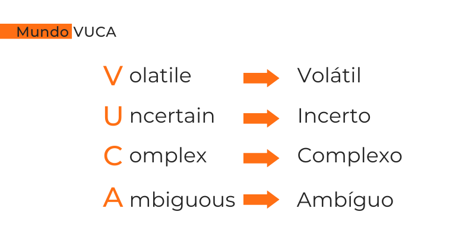

# Mundo VUCA

---

[Mundo VUCA](https://voitto.com.br/blog/artigo/mundo-vuca)

---

O artigo **"Mundo VUCA: o que é e como se preparar para ele"**, publicado no blog da Voitto, aborda o conceito de **VUCA** e como ele impacta o mundo dos negócios e a vida profissional. Aqui estão os pontos principais:

1. **Definição de VUCA**:  
   - VUCA é um acrônimo que representa quatro características do mundo moderno: **Volatilidade**, **Incerteza**, **Complexidade** e **Ambiguidade**.  
   - Esse termo surgiu no contexto militar, mas foi adaptado para descrever o ambiente de negócios atual, marcado por mudanças rápidas e imprevisíveis.
   

2. **Características do Mundo VUCA**:  
   - **Volatilidade**: Mudanças rápidas e inesperadas, muitas vezes sem padrões claros.  
   - **Incerteza**: Dificuldade de prever eventos futuros devido à falta de informações ou à imprevisibilidade.  
   - **Complexidade**: Situações com múltiplas variáveis interconectadas, difíceis de analisar e entender.  
   - **Ambiguidade**: Falta de clareza sobre o significado dos eventos, tornando difícil interpretar situações e tomar decisões.

3. **Impacto no Mundo dos Negócios**:  
   - O ambiente VUCA exige que empresas e profissionais sejam mais ágeis, resilientes e adaptáveis.  
   - A capacidade de responder rapidamente a mudanças e tomar decisões em cenários incertos tornou-se essencial para a sobrevivência e o sucesso.

4. **Como se Preparar para o Mundo VUCA**:  
   - **Desenvolver Resiliência**: A capacidade de se recuperar rapidamente de adversidades e se adaptar a novas situações.  
   - **Fortalecer a Agilidade**: Ser capaz de tomar decisões rápidas e eficazes, mesmo com informações limitadas.  
   - **Investir em Aprendizado Contínuo**: Adotar uma mentalidade de **Lifelong Learning** para se manter atualizado e relevante.  
   - **Promover Colaboração**: Trabalhar em equipe e compartilhar conhecimentos para enfrentar desafios complexos.  
   - **Focar na Inovação**: Buscar soluções criativas e disruptivas para se destacar em um mercado competitivo.

5. **Liderança no Mundo VUCA**:  
   - Líderes precisam ser visionários, empáticos e capazes de inspirar suas equipes em meio à incerteza.  
   - A comunicação clara e a capacidade de tomar decisões sob pressão são habilidades essenciais para liderar em um ambiente VUCA.

6. **Oportunidades no Mundo VUCA**:  
   - Apesar dos desafios, o mundo VUCA também oferece oportunidades para quem está disposto a se adaptar e inovar.  
   - Profissionais e empresas que conseguem navegar pela volatilidade e incerteza podem se destacar e alcançar novos patamares de sucesso.

Em resumo, o **Mundo VUCA** representa um ambiente desafiador, mas também cheio de oportunidades para quem está preparado. Desenvolver resiliência, agilidade, aprendizado contínuo e habilidades de liderança são estratégias essenciais para prosperar nesse cenário dinâmico e imprevisível.
