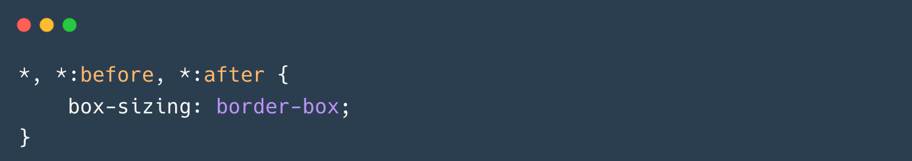

# A propriedade CSS **`box-sizing: border-box`**



---

Você não passará... até conferir este documento útil sobre `box-sizing` no [Web Reference](https://webreference.com).

Uma regra CSS para governar todas, uma regra para alinhá-las, uma regra para trazê-las todas e no markup uni-las. 🧙‍♂️

```css
*, *:before, *:after {
    box-sizing: border-box;
}
```

**CSS box-sizing**  
Com `box-sizing: border-box`, o padding e a borda de um elemento são incluídos na largura e altura do elemento, o que significa que o tamanho que você define é o tamanho que você obtém. Isso torna os layouts muito mais previsíveis e fáceis de controlar.

É isso, essa é a dica do dia, e é uma que vai render dividendos em tempo economizado.

---

### **Explicação Detalhada**

#### **1. O que é `box-sizing: border-box`?**
- **Definição**: A propriedade `box-sizing` controla como a largura e a altura de um elemento são calculadas.
- **Valores**:
  - `content-box` (padrão): A largura e a altura incluem apenas o conteúdo. Padding e borda são adicionados ao tamanho total.
  - `border-box`: A largura e a altura incluem o conteúdo, o padding e a borda. O tamanho definido é o tamanho total do elemento.

---

#### **2. Por que usar `box-sizing: border-box`?**
- **Previsibilidade**: O tamanho do elemento é mais fácil de controlar, pois padding e borda não afetam a largura e altura definidas.
- **Facilidade de layout**: Evita cálculos manuais para ajustar o tamanho dos elementos.
- **Consistência**: Garante que todos os elementos sigam a mesma lógica de dimensionamento.

---

#### **3. Como aplicar `box-sizing: border-box`?**
- Aplique a regra globalmente para todos os elementos, incluindo pseudo-elementos (`:before` e `:after`):
  ```css
  *, *:before, *:after {
      box-sizing: border-box;
  }
  ```

---

#### **4. Exemplo prático**
- **Sem `box-sizing: border-box`**:
  ```css
  .box {
      width: 200px;
      padding: 20px;
      border: 5px solid black;
  }
  ```
  - Largura total: `200px (conteúdo) + 40px (padding) + 10px (borda) = 250px`.

- **Com `box-sizing: border-box`**:
  ```css
  .box {
      width: 200px;
      padding: 20px;
      border: 5px solid black;
      box-sizing: border-box;
  }
  ```
  - Largura total: `200px` (já inclui padding e borda).

---

### **Organizando como Anotação de Estudo**

Aqui está um resumo organizado para você consultar:

---

#### **Propriedade CSS: `box-sizing: border-box`**

**O que é?**
- Propriedade que controla como a largura e a altura de um elemento são calculadas.

**Valores**
- `content-box`: Padding e borda são adicionados ao tamanho do conteúdo (comportamento padrão).
- `border-box`: Padding e borda são incluídos no tamanho definido.

**Por que usar?**
- Torna os layouts mais previsíveis e fáceis de controlar.
- Evita cálculos manuais para ajustar o tamanho dos elementos.
- Garante consistência no dimensionamento.

**Como aplicar?**
- Use a regra globalmente:
  ```css
  *, *:before, *:after {
      box-sizing: border-box;
  }
  ```

**Exemplo prático**
- Sem `box-sizing: border-box`:
  ```css
  .box {
      width: 200px;
      padding: 20px;
      border: 5px solid black;
  }
  ```
  - Largura total: 250px.

- Com `box-sizing: border-box`:
  ```css
  .box {
      width: 200px;
      padding: 20px;
      border: 5px solid black;
      box-sizing: border-box;
  }
  ```
  - Largura total: 200px.

---

#### **Próximos Passos**
1. **Aplique globalmente**: Adicione a regra `box-sizing: border-box` no início do seu CSS.
2. **Teste em seus layouts**: Verifique como os elementos se comportam com e sem a propriedade.
3. **Economize tempo**: Pare de calcular manualmente o tamanho dos elementos!

---

