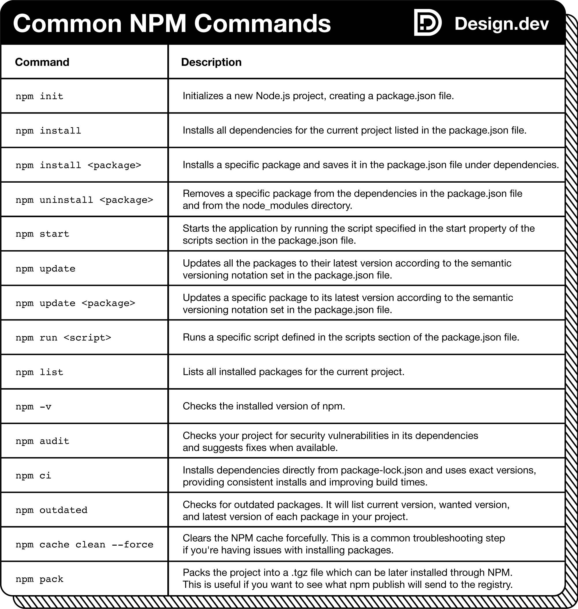

# o **Node Package Manager (NPM)**

---

Dominar o **Node Package Manager (NPM)** é uma habilidade poderosa para gerenciar dependências, scripts e versões em seus projetos JavaScript. O NPM ajuda a evitar conflitos de versão e pode automatizar tarefas como testes e implantação de servidores.

Para começar, certifique-se de ter o **Node.js** instalado no seu sistema.

Em seguida, preparamos uma folha de referência com **15 comandos** comumente usados. Aproveite!



---

### **Explicação Detalhada**

#### **1. O que é o NPM?**
- **Definição**: O NPM é o gerenciador de pacotes padrão para o Node.js, usado para instalar, compartilhar e gerenciar dependências em projetos JavaScript.
- **Funcionalidades**:
  - Instalação de pacotes e bibliotecas.
  - Gerenciamento de versões de dependências.
  - Execução de scripts automatizados (testes, builds, deploys etc.).

---

#### **2. Por que usar o NPM?**
- **Gerenciamento de dependências**: Facilita a instalação e atualização de bibliotecas.
- **Evita conflitos de versão**: Permite especificar versões exatas das dependências.
- **Automatização**: Executa tarefas repetitivas através de scripts definidos no `package.json`.

---

#### **3. Como começar?**
1. **Instale o Node.js**:
   - O NPM vem incluído com o Node.js. Baixe e instale a versão mais recente do [Node.js](https://nodejs.org/).

2. **Verifique a instalação**:
   - No terminal, execute:
     ```bash
     node -v
     npm -v
     ```
   - Isso exibirá as versões do Node.js e do NPM instaladas.

3. **Inicialize um projeto**:
   - Crie um novo diretório para seu projeto e execute:
     ```bash
     npm init
     ```
   - Siga as instruções para criar o arquivo `package.json`.

---

#### **4. Comandos NPM mais usados**
Aqui estão 15 comandos essenciais para dominar o NPM:

1. **Inicializar um projeto**:
   ```bash
   npm init
   ```

2. **Instalar um pacote localmente**:
   ```bash
   npm install <nome-do-pacote>
   ```

3. **Instalar um pacote globalmente**:
   ```bash
   npm install -g <nome-do-pacote>
   ```

4. **Instalar um pacote como dependência de desenvolvimento**:
   ```bash
   npm install <nome-do-pacote> --save-dev
   ```

5. **Atualizar um pacote**:
   ```bash
   npm update <nome-do-pacote>
   ```

6. **Desinstalar um pacote**:
   ```bash
   npm uninstall <nome-do-pacote>
   ```

7. **Listar pacotes instalados**:
   ```bash
   npm list
   ```

8. **Verificar pacotes desatualizados**:
   ```bash
   npm outdated
   ```

9. **Executar scripts definidos no `package.json`**:
   ```bash
   npm run <nome-do-script>
   ```

10. **Instalar todas as dependências de um projeto**:
    ```bash
    npm install
    ```

11. **Publicar um pacote no NPM**:
    ```bash
    npm publish
    ```

12. **Adicionar um usuário ao NPM**:
    ```bash
    npm adduser
    ```

13. **Login no NPM**:
    ```bash
    npm login
    ```

14. **Verificar permissões de um pacote**:
    ```bash
    npm access
    ```

15. **Limpar o cache do NPM**:
    ```bash
    npm cache clean --force
    ```

---

### **Organizando como Anotação de Estudo**

Aqui está um resumo organizado para você consultar:

---

#### **Node Package Manager (NPM)**

**O que é?**
- Gerenciador de pacotes padrão para Node.js, usado para instalar e gerenciar dependências em projetos JavaScript.

**Por que usar?**
- Facilita o gerenciamento de dependências.
- Evita conflitos de versão.
- Automatiza tarefas como testes e deploys.

**Como começar?**
1. Instale o Node.js: [https://nodejs.org/](https://nodejs.org/).
2. Verifique a instalação:
   ```bash
   node -v
   npm -v
   ```
3. Inicialize um projeto:
   ```bash
   npm init
   ```

**Comandos mais usados**
1. Inicializar um projeto:
   ```bash
   npm init
   ```
2. Instalar pacote localmente:
   ```bash
   npm install <nome-do-pacote>
   ```
3. Instalar pacote globalmente:
   ```bash
   npm install -g <nome-do-pacote>
   ```
4. Instalar como dependência de desenvolvimento:
   ```bash
   npm install <nome-do-pacote> --save-dev
   ```
5. Atualizar pacote:
   ```bash
   npm update <nome-do-pacote>
   ```
6. Desinstalar pacote:
   ```bash
   npm uninstall <nome-do-pacote>
   ```
7. Listar pacotes instalados:
   ```bash
   npm list
   ```
8. Verificar pacotes desatualizados:
   ```bash
   npm outdated
   ```
9. Executar scripts:
   ```bash
   npm run <nome-do-script>
   ```
10. Instalar todas as dependências:
    ```bash
    npm install
    ```
11. Publicar um pacote:
    ```bash
    npm publish
    ```
12. Adicionar usuário:
    ```bash
    npm adduser
    ```
13. Login no NPM:
    ```bash
    npm login
    ```
14. Verificar permissões:
    ```bash
    npm access
    ```
15. Limpar cache:
    ```bash
    npm cache clean --force
    ```

---

#### **Próximos Passos**
1. **Crie um projeto**: Use `npm init` para iniciar um novo projeto.
2. **Instale pacotes**: Experimente instalar bibliotecas populares, como `express` ou `lodash`.
3. **Automatize tarefas**: Defina scripts no `package.json` para testes, builds ou deploys.

---

