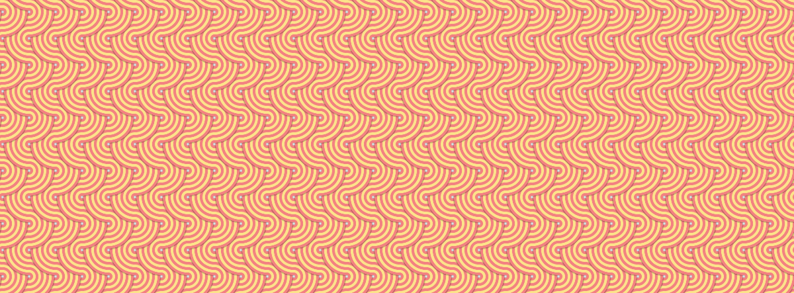

# Padrões de fundo criados com CSS puro

---

É incrível o que o CSS pode fazer atualmente, e temos uma demonstração divertida de padrões de fundo criados com CSS puro para você. Este exemplo é um pouco mais avançado, usando variáveis CSS e múltiplos `radial-gradient`, mas eles são fáceis de dominar com um pouco de prática.

Se você experimentar este código, recomendamos brincar primeiro com as variáveis de tamanho e cor, pois elas rapidamente fornecerão novos padrões variados.

Código


Imagem


---

### **Explicação Detalhada**

#### **1. O que é o exemplo?**
- **Objetivo**: Criar padrões de fundo complexos usando apenas CSS.
- **Técnicas utilizadas**:
  - **Variáveis CSS**: Para facilitar a personalização de cores e tamanhos.
  - **Múltiplos `radial-gradient`**: Para criar efeitos visuais interessantes.

---

#### **2. Como funciona?**
- **Variáveis CSS**:
  - Permitem definir valores reutilizáveis, como cores e tamanhos.
  - Exemplo:
    ```css
    :root {
      --color1: #ff9f43;
      --color2: #ff6b6b;
      --size: 50px;
    }
    ```

- **Radial Gradients**:
  - Criam gradientes circulares que podem ser combinados para formar padrões.
  - Exemplo:
    ```css
    background: radial-gradient(circle, var(--color1), var(--color2));
    ```

- **Combinação de múltiplos gradientes**:
  - Vários `radial-gradient` podem ser sobrepostos para criar efeitos complexos.
  - Exemplo:
    ```css
    background:
      radial-gradient(circle at 25% 25%, var(--color1), transparent),
      radial-gradient(circle at 75% 75%, var(--color2), transparent);
    ```

---

#### **3. Como experimentar?**
- **Passo 1**: Comece ajustando as variáveis de cor (`--color1`, `--color2` etc.).
- **Passo 2**: Altere o tamanho (`--size`) para ver como o padrão se comporta.
- **Passo 3**: Adicione ou remova gradientes para criar novos efeitos.

---

### **Exemplo de Código**

Aqui está um exemplo de código para criar um padrão de fundo com CSS:

```css
:root {
  --color1: #ff9f43; /* Cor 1 */
  --color2: #ff6b6b; /* Cor 2 */
  --size: 50px;      /* Tamanho do padrão */
}

body {
  background:
    radial-gradient(circle at 25% 25%, var(--color1), transparent),
    radial-gradient(circle at 75% 75%, var(--color2), transparent);
  background-size: var(--size) var(--size);
  height: 100vh;
  margin: 0;
}
```

---

### **Organizando como Anotação de Estudo**

Aqui está um resumo organizado para você consultar:

---

#### **Padrões de Fundo com CSS Puro**

**O que é?**
- Técnica para criar padrões de fundo complexos usando apenas CSS.

**Técnicas utilizadas**
- **Variáveis CSS**: Para definir cores e tamanhos reutilizáveis.
- **Múltiplos `radial-gradient`**: Para criar efeitos visuais interessantes.

**Como funciona?**
1. Defina variáveis CSS para cores e tamanhos:
   ```css
   :root {
     --color1: #ff9f43;
     --color2: #ff6b6b;
     --size: 50px;
   }
   ```
2. Use `radial-gradient` para criar gradientes circulares:
   ```css
   background: radial-gradient(circle, var(--color1), var(--color2));
   ```
3. Combine múltiplos gradientes para formar padrões:
   ```css
   background:
     radial-gradient(circle at 25% 25%, var(--color1), transparent),
     radial-gradient(circle at 75% 75%, var(--color2), transparent);
   ```

**Como experimentar?**
- Ajuste as variáveis de cor (`--color1`, `--color2`).
- Altere o tamanho (`--size`).
- Adicione ou remova gradientes para criar novos efeitos.

**Exemplo de Código**
```css
:root {
  --color1: #ff9f43;
  --color2: #ff6b6b;
  --size: 50px;
}

body {
  background:
    radial-gradient(circle at 25% 25%, var(--color1), transparent),
    radial-gradient(circle at 75% 75%, var(--color2), transparent);
  background-size: var(--size) var(--size);
  height: 100vh;
  margin: 0;
}
```

---

#### **Próximos Passos**
1. **Experimente no CodePen**: Crie um projeto no [CodePen](https://codepen.io) para testar o código.
2. **Explore outras técnicas**: Pesquise sobre `linear-gradient`, `conic-gradient` e outras funções CSS.
3. **Compartilhe seus designs**: Mostre seus padrões criados para a comunidade!

---

