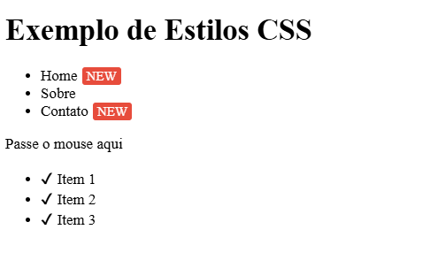

# Documentação: Explicação do Código CSS

## 1. Classe `.nav-item.new::after`
### Descrição:
Adiciona um rótulo "NEW" após elementos que possuem a classe `nav-item new`. 

### Correção do código:
```css
.nav-item.new::after {
    content: "NEW";
    background: #e74c3c;
    font-size: 0.7rem;
    padding: 2px 5px;
    border-radius: 3px;
    margin-left: 5px;
    color: white;
}
```

### Explicação:
- `content: "NEW";` → Adiciona o texto "NEW" após o elemento.
- `background: #e74c3c;` → Define a cor de fundo vermelha.
- `font-size: 0.7rem;` → Define o tamanho da fonte menor.
- `padding: 2px 5px;` → Define espaçamento interno.
- `border-radius: 3px;` → Arredonda os cantos do rótulo.
- `margin-left: 5px;` → Cria espaçamento à esquerda.
- `color: white;` → Adiciona cor ao texto para garantir visibilidade.

---

## 2. Classe `.tooltip` e `.tooltip:hover::before`
### Descrição:
Cria um tooltip (dica de ferramenta) quando o usuário passa o mouse sobre um elemento com a classe `.tooltip`.

### Explicação do código:
```css
.tooltip {
    position: relative;
}

.tooltip:hover::before {
    content: attr(data-tip);
    position: absolute;
    top: -30px;
    background: #333;
    color: white;
    padding: 5px;
    border-radius: 3px;
}
```

### Como funciona:
- `.tooltip { position: relative; }` → Define um posicionamento relativo para que o `::before` seja posicionado corretamente.
- `.tooltip:hover::before {}` → Ativado quando o usuário passa o mouse sobre o elemento.
  - `content: attr(data-tip);` → Obtém o texto do atributo `data-tip` do elemento HTML.
  - `position: absolute;` → Posiciona o tooltip relativo ao elemento pai.
  - `top: -30px;` → Move o tooltip para cima.
  - `background: #333;` → Define o fundo escuro.
  - `color: white;` → Define a cor do texto como branco.
  - `padding: 5px;` → Adiciona espaçamento interno ao tooltip.
  - `border-radius: 3px;` → Adiciona cantos arredondados.

### Exemplo de uso:
```html
<div class="tooltip" data-tip="Isso é um tooltip">Passe o mouse aqui</div>
```

---

## 3. Classe `.custom-list li::before`
### Descrição:
Adiciona um símbolo de check (✔) antes de cada item de lista dentro de `.custom-list`.

### Explicação do código:
```css
.custom-list li::before {
    content: "\2714"; /* Unicode para o checkmark ✔ */
}
```

### Como funciona:
- `.custom-list li::before {}` → Aplica um estilo antes de cada `<li>` dentro da lista com classe `.custom-list`.
- `content: "✔";` → Adiciona o símbolo de check antes do texto do item da lista.

### Exemplo de uso:
```html
<ul class="custom-list">
    <li>Item 1</li>
    <li>Item 2</li>
    <li>Item 3</li>
</ul>
```

Isso resultará em:
✔ Item 1  
✔ Item 2  
✔ Item 3  

---

## 4. Exemplo Completo em HTML
```html
<!DOCTYPE html>
<html lang="pt-br">
<head>
    <meta charset="UTF-8">
    <meta name="viewport" content="width=device-width, initial-scale=1.0">
    <title>Exemplo de CSS</title>
    <style>
        .nav-item.new::after {
            content: "NEW";
            background: #e74c3c;
            font-size: 0.7rem;
            padding: 2px 5px;
            border-radius: 3px;
            margin-left: 5px;
            color: white;
        }

        .tooltip {
            position: relative;
        }

        .tooltip:hover::before {
            content: attr(data-tip);
            position: absolute;
            top: -30px;
            background: #333;
            color: white;
            padding: 5px;
            border-radius: 3px;
        }

        .custom-list li::before {
            content: "\2714";
            margin-right: 5px;
        }
    </style>
</head>
<body>
    <h1>Exemplo de Estilos CSS</h1>
    
    <nav>
        <ul>
            <li class="nav-item new">Home</li>
            <li class="nav-item">Sobre</li>
            <li class="nav-item new">Contato</li>
        </ul>
    </nav>

    <div class="tooltip" data-tip="Isso é um tooltip">Passe o mouse aqui</div>
    
    <ul class="custom-list">
        <li>Item 1</li>
        <li>Item 2</li>
        <li>Item 3</li>
    </ul>
</body>
</html>
```



---

## Considerações finais
O código apresentado utiliza pseudo-elementos (`::before` e `::after`) para criar efeitos visuais sem a necessidade de alteração do HTML. O tooltip, em especial, usa o atributo `data-tip`, permitindo conteúdo dinâmico e reutilizável. 

Esse código é útil porque melhora a experiência do usuário sem adicionar elementos extras no HTML. Aqui estão alguns benefícios:

1. **Melhora a organização do código**  
   - O uso de `::before` e `::after` mantém o HTML mais limpo, evitando elementos desnecessários.
   
2. **Facilidade de manutenção**  
   - Como os estilos são aplicados via CSS, é mais fácil atualizar a aparência sem modificar o HTML.

3. **Aprimora a experiência do usuário**  
   - O tooltip exibe informações adicionais de forma intuitiva ao passar o mouse.
   - O selo "NEW" destaca novos itens sem a necessidade de alterar o conteúdo do HTML manualmente.
   - Os marcadores de check (`✔`) deixam a lista mais visualmente agradável.

4. **Flexibilidade**  
   - O tooltip utiliza `data-tip`, permitindo diferentes textos sem alterar o CSS.
   - As mudanças visuais são feitas apenas com estilos, tornando o código mais reutilizável.

